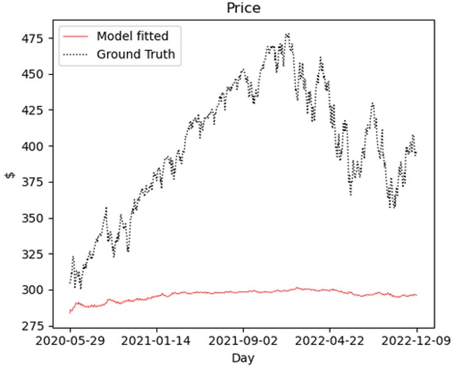
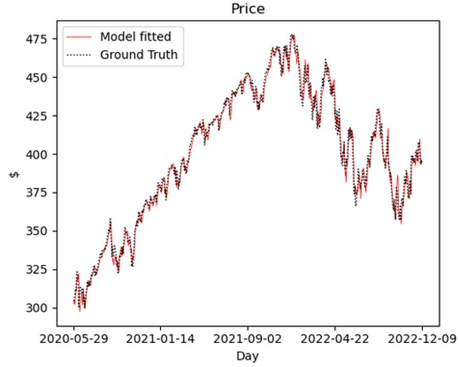
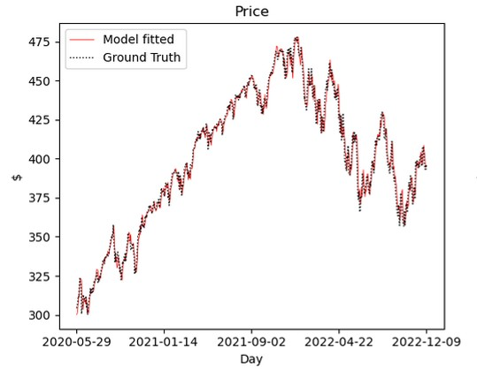

# Transformer-Stock

## 📜Introduction

Main ideas of the models used...

(i) ***Informer Model***: makes longer-horizon forecasting possible by being more selective about what it attends to and by compressing information as it goes, so we can use transformer model on time series data more efficiently without the usual compute burden

(ii) ***NS-Transformer Model***: "NS" stands for "non-stationary". This model stabilizes the non-stationary input while still let the model "see" regime changes. It doesn't involve the relatively abrupt transformation of the input data, like taking difference, as in the usual way to turn non-stationary data stationary, so less information is lost this way (like trend is preserved). 

(iii) ***NS-Informer model***: the main innovation in this repo which combines the NS-transformer module into the Informer model so that it keeps the efficiency of the informer and adds NS-transformer's stabilization an regime-awareness. This makes the forecast more robust. 

## 📜Model Results

### 📌Methodology: "Rolling Prediction"

- Throughout the test set, the past 20-day data (prediction window) is used to predict the Close price of the coming 5 days

- After each prediction, the prediction window rolls forward by one day and make the next prediction

### 📌Visualization of Model Predicted Results

- In each prediction, the first day prediction in the 5-day predicted Close price sequence are collected (which is supposed to be the most reliable in the 5-day prediction)

- In each of the model plot, <br>
```
Red curve: Predicted Close price by the corresponding model
Dotted curve: Ground Truth of Close price
``` 
#### 💡(i) Informer Model:



💬Comments:
1) The informer model cannot adapt to the trend of the unseen data 
2) Probably learn the trend in the training data too well
3) The Close price is non-stationary </br>
   => likely the model cannot predict the change of the trend (the change in the mean) and the change in variance

#### 💡(ii) NS-Transformer Model:



💬Comments: </br>
NS-Transformer can do a much better job than the informer in adapting to the changing trend of the unseen data

#### 💡(iii) NS-Informer Model:



💬Comments: </br>
When the NS components are added to the Informer model, it can also catch up with the trend in the unseen data quite well.

## Trading Performance using Model Prediction

> ***Motivation***: The result graphs above might be misleading in terms of financial trading. The small deviation from the ground truth might not be apparent in this time scale of the graph and that could lead to huge loss.

What we care more is the profit we can make. So use a ***simple strategy*** to simulate how much profit can be generated in the testing period if we follow the model prediction:

- When the model predicts the price will rise by >0.5% on the next day and we do not have any stock on hand, we buy the stock </br>
<mark>(** Every time we spend $1000 to buy the stock and assume we could buy a fraction of the stock for simplicity)</mark>

- When the model predicts the price will drop by >0.5% on the next day and we are holding some stock, we sell all of them </br>
<mark>(** After selling the stock each time, we add the gain/loss to the total profit (note the profit will not be reinvested))</mark>

### Results:

<table style="border: 1px solid black;border-collapse: collapse;">
  <thead>
    <tr>
      <th style="border: none; padding: 10px;"></th>
      <th style="border: none; padding: 10px;">ARIMA</br>(Baseline)</th>
      <th style="border: none; padding: 10px;">Informer</th>
      <th style="border: none; padding: 10px;">NS-Transformer</th>
      <th style="border: none; padding: 10px;">NS-Informer</th>
    </tr>
  </thead>
  <tbody>
    <tr>
      <td style="border: none; padding: 10px;">Profit:</td>
      <td style="border: none; padding: 10px;">26%</td>
      <td style="border: none; padding: 10px;">0%</td>
      <td style="border: none; padding: 10px;">30%</td>
      <td style="border: none; padding: 10px;">35%</td>
    </tr>
  </tbody>
</table>

We can see the our ***NS-Informer*** model performs the best!

The NS-transformer model performs better than the baseline ARIMA model. 

For the informer model, since the predicted daily price variation is too small, there is barely any trading triggered. Therefore there is ~0% profit. 

## 📜Code Usage 

> The transformer-based models were modified from the official repo of [Informer](https://github.com/zhouhaoyi/Informer2020) and [NS-Transformer](https://github.com/thuml/Nonstationary_Transformers) for predicting stock data.

📌***Input feature(s)*** (e.g. Open, High, Low, Close, Volume) can be specified manually in the `args.auxil_features` variable (in the `.ipynb` files) to predict any intended ***target(s)*** (e.g. Close) indicated by the `args.target` variable.

The details of stock data of SPY (SPDR S&P 500 ETF Trust) used in the models can be found in the data exploration file `data_prep_and_exploration.ipynb`. 

### (1) How to use the codes
========================================
The way to run the codes for the transformer-based models and the relevant results can be found in the `.ipynb` files:

- Informer model for Stock Price -> `informer_price.ipynb`  <br>
- Informer model for Daily % Change of Stock Price  -> `informer_percent_change.ipynb` <br>

- NS-Transformer model for Stock Price -> `nstransformer_price.ipynb` <br>
- NS-Informer model for Stock Price -> `ns_Informer_price.ipynb` <br>

### (2) Baseline model
========================================
The simple ARIMA model is used as a baseline model to compare and evaluate the transformer-based model performance. Its relevant code and results can be found in `arima_percent_change.ipynb`


